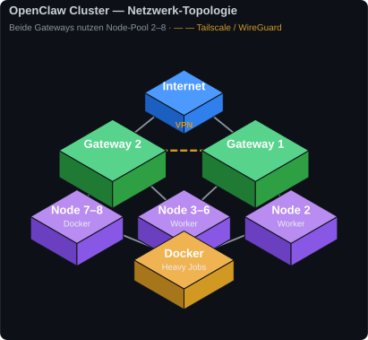
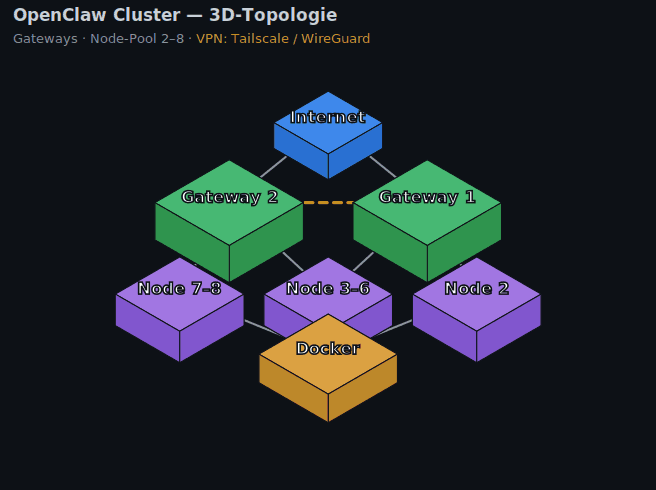
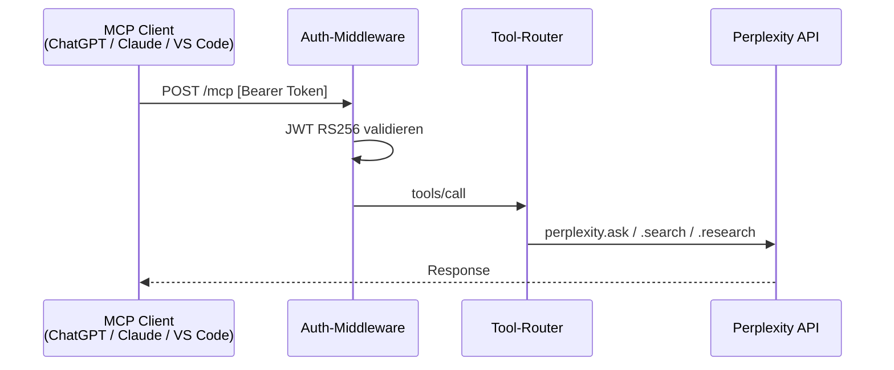

# OpenClaw Cluster


Dieses Repository enthält die synchronisierten Workspaces der OpenClaw AI Gateways
(openclaw.ai). Die Gateways arbeiten als KI/AI-Gateways im Clusterverbund innerhalb
einer bestehenden Netzwerkinfrastruktur. Verbundene OpenClaw Nodes werden über interne
Systemmechanik und nginx Load-Balancer als Worker- und Relay-Nodes eingesetzt.

## Repository-Struktur

| Branch | Beschreibung |
| ------ | ----------- |
| `main` | Dieses Dokument, Sicherheitsrichtlinie, Issue-Vorlagen |
| `gateway1` | Workspace von Gateway 1 — Skills, Scripts, Agents, Memory, Cron |
| `gateway2` | Workspace von Gateway 2 — Infrastruktur, WireGuard VPN, SSH-Tunnel |
| `gateway1-abstractions` | Script-Abstraktionen von Gateway 1 (automatisch synchronisiert) |
| `gateway2-abstractions` | Script-Abstraktionen von Gateway 2 (automatisch synchronisiert) |

## Netzwerk-Topologie



<details>
<summary>🔄 Rotierende 3D-Ansicht (animiertes GIF)</summary>



</details>

> 🧊 **[Interaktive 3D-Ansicht öffnen](https://kikikari.github.io/OpenClaw/)** — drehbar & zoombar (three.js, Branch [`gh-pages`](../../tree/gh-pages); GitHub Pages muss dafür aktiviert sein).
>
> Diagramme reproduzierbar via [`assets/gen_topology.py`](assets/gen_topology.py) (SVG) und [`assets/gen_topology_gif.py`](assets/gen_topology_gif.py) (GIF).

Beide Gateways können **Nodes 2–8** als Worker- oder Relay-Nodes verwenden —
je nach aktueller Erreichbarkeit, Verfügbarkeit und Priorität.
Auf den Nodes vorbereitete Docker-Container werden für rechenintensive
Jobs, Abstraktionen und andere Aufgaben eingesetzt.

## Abstraction Manager

Jeder Gateway betreibt einen **Abstraction Manager**, der automatisch
Abstraktionen der verwendeten Scripts und Programme erstellt und in die
jeweiligen `*-abstractions`-Branches sowie auf ClawHub (Skills) veröffentlicht.

### ABSTRACTIONS_MANAGER.py

Portiert OpenClaw-Scripts alle 6 Stunden per Cron in 10 Zielsprachen.
Verteilt Jobs nach Gewicht auf die verfügbaren Nodes.

| Zielsprache | Extension | Zielsprache | Extension |
| --- | --- | --- | --- |
| perl5 | `.pl` | powershell | `.ps1` |
| perl6 | `.raku` | tcl | `.tcl` |
| javascript | `.js` | ruby | `.rb` |
| python | `.py` | lua | `.lua` |
| shell | `.sh` | go | `.go` |

> Der Manager unterstützt 10 Zielsprachen; aktuell sind 6 davon generiert
> (js, perl5, python, powershell, shell, tcl — siehe `*-abstractions`-Branches).

**Job-Gewicht → Node-Auswahl:**

| Gewicht | Bedingung | Bevorzugte Nodes |
| --- | --- | --- |
| heavy | `Dateigröße × Sprachen > 50.000` | node7 → node2 → node1 |
| medium | `Dateigröße × Sprachen > 10.000` | node2 → node1 → node7 |
| light | sonst | node5 → node1 → node2 |

State-Persistenz: atomisches Schreiben via `tempfile` + `os.replace()` nach
`db/abstractions_state.json`. Alle subprocess-Aufrufe verwenden Listform
(`shell=False`). Git-Commits via `git -C <pfad>` ohne `os.chdir()`.

### db_manager.py

Erstellt und befüllt zwei SQLite-Datenbanken unter `db/`:

| Datenbank | Inhalt |
| --- | --- |
| `docs.db` | Dokumentenindex (documents, categories, symlinks, skills) |
| `tree.db` | Verzeichnisbaum-Scan (tree_entries, tree_scans) |

Beide Datenbanken exportieren via `export_csv()` / `export_json()`.
Tabellennamen werden gegen ein `frozenset` validiert (SQL-Injection-Schutz).

## ClawHub — Veröffentlichte Skills

Die Abstraction Manager beider Gateways veröffentlichen Skills automatisch
im öffentlichen OpenClaw Registry auf **[clawhub.ai/@KikiKari](https://clawhub.ai/@KikiKari)**.

### Installation

```bash
# Skill suchen / Search skills
openclaw skills search "cluster-gateway"

# Skill installieren / Install skill
openclaw skills install <skill-slug>

# Alle Skills aktualisieren / Update all skills
openclaw skills update --all
```

### Veröffentlichte Skills / Published Skills

| Skill | Version | Downloads | Security | Install |
| --- | --- | --- | --- | --- |
| Cluster Gateway | v1.0.0 | 292 | ✅ Pass | `openclaw skills install cluster-gateway` |
| MCP Tool Utils | v1.0.0 | 338 | ✅ Pass | `openclaw skills install mcp-tool-utils` |
| Reports Creator | v1.0.0 | 289 | ✅ Pass | `openclaw skills install reports-creator` |
| Relay Node | v1.0.0 | 298 | ✅ Pass | `openclaw skills install relay-node` |
| JSON Utils | v1.0.0 | 304 | ✅ Pass | `openclaw skills install json-utils` |
| Log Collector | v1.0.0 | 302 | 🔍 Review | `openclaw skills install log-collector` |
| TikTok Live Monitor | v1.0.0 | 288 | 🔍 Review | `openclaw skills install tiktok-live-monitor` |
| Doc Scraper | v1.0.0 | 290 | 🔍 Review | `openclaw skills install doc-scraper` |
| Workspace Database Manager | v1.0.0 | 312 | 🔍 Review | `openclaw skills install workspace-database-manager` |
| Scripting Utils | v1.0.0 | 269 | 🔍 Review | `openclaw skills install scripting-utils` |

> Downloads und Security-Status werden vom Abstraction Manager bei jedem
> Sync aktualisiert. / Downloads and security status are updated by the
> Abstraction Manager on each sync.

### Skills in Entwicklung / Skills in Development

| Skill | Beschreibung | Benchmark |
| --- | --- | --- |
| python-hardener | Härtet Python-Scripts: Shell-Injection, `os.chdir()`, bare `except`, `RotatingFileHandler`, atomisches State-Write, Docstrings | 100% Pass (mit Skill) vs. 66,7% (ohne) |

```bash
# Sobald veröffentlicht / Once published:
openclaw skills install python-hardener
```

## Abstractions Utilities

Wiederverwendbare Utility-Module, die vom Abstraction Manager erzeugt
und in den `*-abstractions`-Branches gepflegt werden.

### json_processor.js

JavaScript-Modul für JSON-Verarbeitung in der Abstraktions-Pipeline.

| Funktion | Beschreibung |
| --- | --- |
| `serializeToFormattedJson(data, indent, sortKeys)` | Serialisiert Objekte in formatierten JSON-String, wirft `RangeError` / `TypeError` |
| `parseJsonSafely(jsonString, fallback)` | Parse ohne Exception — gibt Fallback zurück bei Fehler |
| `readJsonFile(filePath)` | Liest JSON-Datei, propagiert `Error` / `SyntaxError` |
| `writeJsonFileAtomically(filePath, data)` | Schreibt atomar via `.tmp` + `fs.renameSync()` |
| `getNestedValue(obj, 'a.b.c', default)` | Extraktion via Dot-Notation, kein Crash bei fehlendem Pfad |

Strukturiertes Logging via `ABSTRACTIONS_LOG_LEVEL` / `ABSTRACTIONS_JSON_LOGGING`
Umgebungsvariablen — kein externes Logger-Paket erforderlich.

## Weitere Projekte / Related Projects

### MCP-OAuth-Proxy

Selbst gehosteter **Remote-MCP-Server** auf dem Ubuntu-Gateway-Server,
der als OAuth-2.1-gesicherter Proxy vor der Perplexity-API sitzt.

| Parameter | Wert |
| --- | --- |
| **Zweck** | Externe MCP-Clients (ChatGPT, Claude, VS Code) via OAuth 2.1 + PKCE an Perplexity-API anbinden |
| **Problem** | Perplexity-Daemon spricht proprietäres OAuth — nur VS Code (SSH-Session) kann sich direkt verbinden |
| **Stack** | Node.js / TypeScript, Express 5, SQLite, jsonwebtoken (RS256) |
| **Auth** | OAuth 2.1 + PKCE, Dynamic Client Registration (RFC 7591) |
| **Tunnel** | Cloudflare Named Tunnel (öffentlich) + Tailscale (interne Clients) |
| **Status** | 🔧 In Entwicklung |



### coding-agent

GitHub Project Board für KI-gestützte Entwicklungsaufgaben im OpenClaw-Cluster.

→ [github.com/users/KikiKari/projects/1](https://github.com/users/KikiKari/projects/1)

## Automatische Synchronisation

| Typ | Zeitpunkte |
| --- | --------- |
| Gateway-Workspace | täglich ~06:15 und ~18:15 Uhr |
| Script-Abstraktionen | täglich ~04:35 und ~13:35 Uhr |
