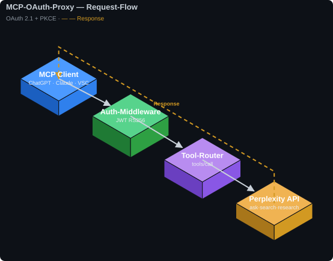
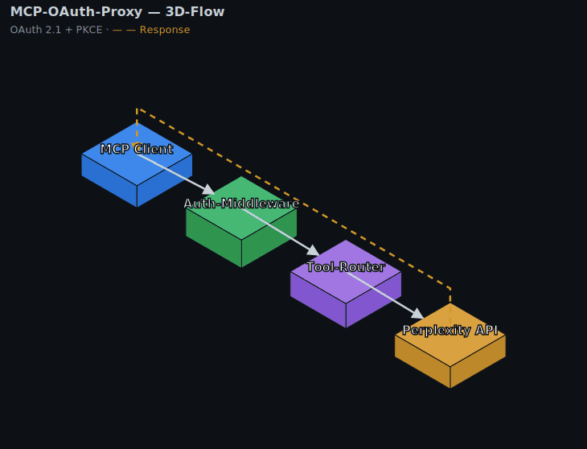
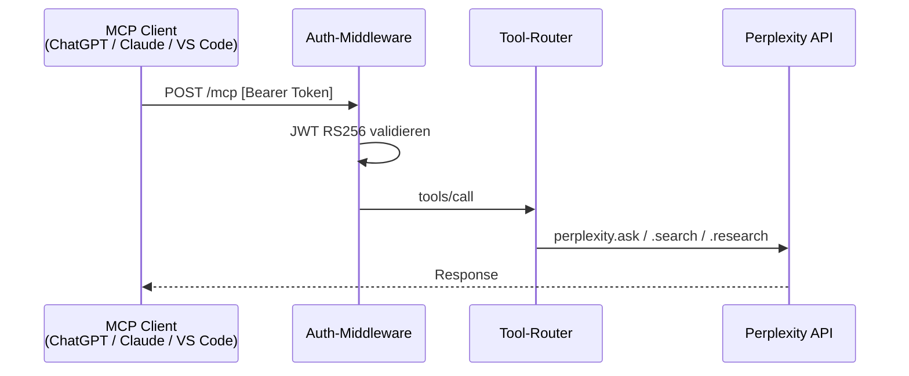
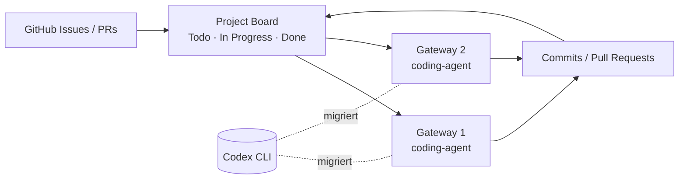
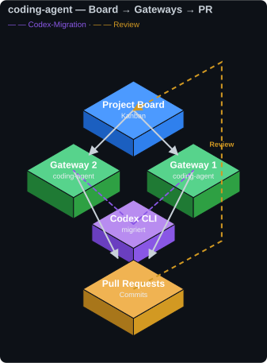

# OpenClaw — Codespace Infrastructure

This branch (`verbose-waddle`) is part of the **OpenClaw Cluster** GitHub infrastructure.
It was built and optimized using [Claude Code](https://claude.ai/code) and serves as the
GitHub infrastructure setup and the maintenance base for the `main` default branch —
repository structure, documentation, gateway configs, and agent rules.

→ Main repository: [KikiKari/OpenClaw](https://github.com/KikiKari/OpenClaw)

---

## Codespace Architecture

OpenClaw uses two dedicated GitHub Codespaces for development and infrastructure:

### verbose-waddle · `KikiKari/OpenClaw` (this branch)
> GitHub Infrastructure · Main Default · Sandbox

- **Origin:** Created directly from `KikiKari/OpenClaw` (2-core · 8GB RAM)
- **Role:** Sets up and maintains the `main` default branch — the authoritative
  source for repository structure, documentation, gateway configs, and agent rules
- **Contains:** MCP configurations, `AGENTS.md`, `CLAUDE.md`, `GEMINI.md`,
  gateway branch management, security policies, and maintenance scripts
- **Sandbox:** Used for testing new repository structures before merging to `main`

### special-engine · `github/codespaces-react`
> Claude Code · GitHub Optimization · Interpolation

- **Origin:** Created from `github/codespaces-react` template (4-core · 16GB RAM)
- **Role:** Claude Code-driven GitHub optimization — builds the frontend client,
  publishes packages, generates GitHub Actions workflows, and interpolates between
  the OpenClaw branches and external package registries
- **Contains:** React/Vite frontend, npm package, Docker image, multi-language
  code examples, CI/CD pipeline definitions

---

## Maintenance & Scripts

verbose-waddle maintains the `main` README and repository structure. Helper scripts
live in [`scripts/`](https://github.com/KikiKari/OpenClaw/tree/main/scripts) on `main`:

| Script | Purpose |
|---|---|
| `update_readme_stats.py` | Refreshes the badge / stat counts in the `main` README |
| `pplx-tools/` | Authenticate the Perplexity MCP daemon as **Pro** in a headless Codespace via session-cookie injection (no browser/Cloudflare login) |

```bash
# Refresh README stats on main
python3 scripts/update_readme_stats.py

# Re-authenticate the Perplexity MCP session (see scripts/pplx-tools/README.md)
scripts/pplx-tools/pplx-refresh.sh
```

---

## Published Packages

Cluster artifacts are built and distributed from the `special-engine` branch:

| Package | Registry | Description |
|---|---|---|
| `@kikikari/openclaw-client` | [GitHub Packages (npm)](https://github.com/KikiKari/OpenClaw/packages) | React/JS frontend client |
| `openclaw-py` | [PyPI](https://pypi.org/project/openclaw-py) | Python gateway client library |
| `ghcr.io/kikikari/openclaw` | [GitHub Container Registry](https://github.com/KikiKari/OpenClaw/pkgs/container/openclaw) | Docker image |

---

## Branch Overview

| Branch | Description |
|---|---|
| `main` | Documentation, security policies, gateway structure |
| `gateway1` / `gateway2` | Gateway node configurations |
| `gateway1-abstractions` / `gateway2-abstractions` | Abstraction layers |
| `gh-pages` | GitHub Pages — [kikikari.github.io/OpenClaw](https://kikikari.github.io/OpenClaw/) |
| `verbose-waddle` | GitHub infrastructure setup & sandbox |
| `special-engine` | Claude Code frontend & package distribution |

---

## ClawHub Skills

### Installation

```bash
# Skill suchen / Search skills
openclaw skills search "cluster-gateway"

# Skill installieren / Install skill
openclaw skills install <skill-slug>

# Alle Skills aktualisieren / Update all skills
openclaw skills update --all
```

### Veröffentlichte Skills / Published Skills

| Skill | Version | Downloads | Security | Install |
| --- | --- | --- | --- | --- |
| Cluster Gateway | v1.0.0 | 496 | ✅ Pass | `openclaw skills install cluster-gateway` |
| MCP Tool Utils | v1.0.0 | 571 | ✅ Pass | `openclaw skills install mcp-tool-utils` |
| Reports Creator | v1.0.0 | 505 | ✅ Pass | `openclaw skills install reports-creator` |
| Relay Node | v1.0.0 | 518 | ✅ Pass | `openclaw skills install relay-node` |
| JSON Utils | v1.0.0 | 554 | ✅ Pass | `openclaw skills install json-utils` |
| Log Collector | v1.0.0 | 502 | 🔍 Review | `openclaw skills install log-collector` |
| TikTok Live Monitor | v1.0.0 | 288 | 🔍 Review | `openclaw skills install tiktok-live-monitor` |
| Doc Scraper | v1.0.0 | 492 | 🔍 Review | `openclaw skills install doc-scraper` |
| Workspace Database Manager | v1.0.0 | 312 | 🔍 Review | `openclaw skills install workspace-database-manager` |
| Scripting Utils | v1.0.0 | 448 | 🔍 Review | `openclaw skills install scripting-utils` |

> Downloads und Security-Status werden vom Abstraction Manager bei jedem
> Sync aktualisiert. / Downloads and security status are updated by the
> Abstraction Manager on each sync.

### Skill: python-hardener — ✅ Fertiggestellt

Härtet bestehende Python-Scripts automatisch und liefert zusätzlich eine
Markdown-Dokumentation der Änderungen. Entwicklung abgeschlossen, durch eine
Eval-Suite abgesichert.

**Härtungsregeln**

| Schwachstelle / Smell | Korrektur |
| --- | --- |
| `shell=True` in subprocess | Argument-Liste, kein Shell-Interpreter |
| `os.chdir()` (Prozess-CWD-Mutation) | `git -C <pfad>` bzw. `cwd=`-Parameter |
| bare `except:` | spezifische Exception-Typen + Logging |
| Logfile bei jedem Aufruf geöffnet | `RotatingFileHandler`, einmalig konfiguriert |
| nicht-atomares State-Schreiben | `tempfile` + `os.replace()` |
| SQL-Injection (f-string-Query) | parametrisierte Queries + Tabellen-Allowlist |
| Verbindung nie geschlossen | Context-Manager / `finally` / `close()` |
| fehlende Docstrings / Typannotationen | Google-/NumPy-Style Docstrings, Type-Hints |

**Eval-Suite** (`evals.json` — 2 Szenarien, 11 Assertions)

| Eval | Fokus | Assertions |
| --- | --- | --- |
| `job-runner-full-hardening` | Cron-Runner: Shell-Injection, CWD, Logging, atomarer State | 6 |
| `report-db-sql-injection-and-connection` | DB-Modul: SQL-Injection, Connection-Cleanup, Docstrings | 5 |

**Benchmark** (Pass-Rate, gemittelt über beide Evals)

| Konfiguration | Pass-Rate |
| --- | --- |
| **mit python-hardener** | **100 %** (11/11 Assertions) |
| Baseline (ohne Skill) | 83 % — `job-runner` 67 %, `report-db` 100 % |

```bash
openclaw skills install python-hardener
```

### pplx-tools — ✅ Fertiggestellt

Skriptpaket (`scripts/pplx-tools/`) zur Authentifizierung des Perplexity-MCP-Daemons
als **Pro** in einem headless Codespace — ohne Browser-/Cloudflare-Login. Statt der
interaktiven Anmeldung (die an Cloudflare auf der Datacenter-IP scheitert) wird ein
lokal exportierter Session-Cookie in den Vault injiziert. Entwicklung abgeschlossen,
End-to-End verifiziert (`✅ authenticated — tier: Pro`).

| Skript | Funktion |
| --- | --- |
| `pplx-refresh.sh` | Hauptbefehl: Browser-Setup → Passphrase aus Daemon → Cookie injizieren → Reinit → Verify |
| `pplx-inject.mjs` | Schreibt den Session-Cookie in `vault.enc` (Token / Cookie-Header / JSON) |
| `pplx-setup.sh` | Installiert idempotent die zur VS-Code-Extension passende Chromium-Revision |
| `pplx-status.sh` | Zeigt Auth-Status (`authenticated`, `tier`) + Log-Auszug |

**Kernerkenntnis:** Cloudflare blockt nur *unauthentifizierte* Calls von der
Datacenter-IP. Mit gültiger Session laufen Suche & Co. über impit (HTTP) durch;
der Browser wird nur beim Reinit zur Validierung gebraucht.

```bash
# Session erneuern (Session-Cookie in ~/pplx-cookies.txt ablegen, dann):
scripts/pplx-tools/pplx-refresh.sh
```

## Packages

[](https://github.com/KikiKari/OpenClaw/actions/workflows/npm-publish-pplx-tools.yml)
[](https://github.com/KikiKari/OpenClaw/actions/workflows/docker-publish-extras.yml)
[](https://github.com/KikiKari/OpenClaw/actions/workflows/docker-publish.yml)
[](https://github.com/KikiKari/OpenClaw/actions/workflows/npm-publish.yml)

Veröffentlicht auf GitHub Packages — Übersicht: **[github.com/KikiKari?tab=packages](https://github.com/KikiKari?tab=packages)**

| Package | Typ | Quelle | Pull / Install |
| --- | --- | --- | --- |
| [`openclaw`](https://github.com/KikiKari/OpenClaw/pkgs/container/openclaw) | Container | [`Dockerfile`](Dockerfile) | `docker pull ghcr.io/kikikari/openclaw:latest` |
| [`@kikikari/openclaw-client`](https://github.com/KikiKari/OpenClaw/pkgs/npm/openclaw-client) | npm | branch [`special-engine`](https://github.com/KikiKari/OpenClaw/tree/special-engine) | `npm i @kikikari/openclaw-client` |
| [`@kikikari/pplx-tools`](https://github.com/KikiKari/OpenClaw/pkgs/npm/pplx-tools) | npm | [`scripts/pplx-tools/`](scripts/pplx-tools) | `npm i @kikikari/pplx-tools` |
| [`skill-python-hardener`](https://github.com/KikiKari/OpenClaw/pkgs/container/skill-python-hardener) | Container | [`packages/skill-python-hardener/`](packages/skill-python-hardener) | `docker pull ghcr.io/kikikari/skill-python-hardener:latest` |
| [`mcp-flow-svg`](https://github.com/KikiKari/OpenClaw/pkgs/container/mcp-flow-svg) | Container | [`packages/mcp-flow-svg/`](packages/mcp-flow-svg) | `docker pull ghcr.io/kikikari/mcp-flow-svg:latest` |
| [`mcp-flow-gif`](https://github.com/KikiKari/OpenClaw/pkgs/container/mcp-flow-gif) | Container | [`packages/mcp-flow-gif/`](packages/mcp-flow-gif) | `docker pull ghcr.io/kikikari/mcp-flow-gif:latest` |

**Container nutzen / usage:**

```bash
# SVG bzw. GIF des MCP-OAuth-Flows nach ./out erzeugen / render into ./out
docker run --rm -v "$PWD/out":/out ghcr.io/kikikari/mcp-flow-svg:latest
docker run --rm -v "$PWD/out":/out ghcr.io/kikikari/mcp-flow-gif:latest

# python-hardener Skill-Definition anzeigen / print skill definition
docker run --rm ghcr.io/kikikari/skill-python-hardener:latest
```

**npm aus GitHub Packages installieren / install** — `.npmrc` im Projekt:

```ini
@kikikari:registry=https://npm.pkg.github.com
//npm.pkg.github.com/:_authToken=${GITHUB_TOKEN}   # Token mit read:packages
```

> **Hinweise:** Neue ghcr-Pakete sind anfangs **privat** — Sichtbarkeit je Paket unter
> *Package settings → Danger Zone → Change visibility → Public*. Container-Paketseiten
> zeigen als README-**Body** stets die Repo-README (GHCR-Limit bei mehreren Images pro
> Repo); die paket-spezifische Kurzbeschreibung kommt aus
> `org.opencontainers.image.description`. Die npm-Pakete zeigen ihre eigene gebündelte
> README. Updates: `version` in der jeweiligen `package.json` erhöhen.

## Abstractions Utilities

Wiederverwendbare Utility-Module, die vom Abstraction Manager erzeugt
und in den `*-abstractions`-Branches gepflegt werden.

### json_processor.js

JavaScript-Modul für JSON-Verarbeitung in der Abstraktions-Pipeline.

| Funktion | Beschreibung |
| --- | --- |
| `serializeToFormattedJson(data, indent, sortKeys)` | Serialisiert Objekte in formatierten JSON-String, wirft `RangeError` / `TypeError` |
| `parseJsonSafely(jsonString, fallback)` | Parse ohne Exception — gibt Fallback zurück bei Fehler |
| `readJsonFile(filePath)` | Liest JSON-Datei, propagiert `Error` / `SyntaxError` |
| `writeJsonFileAtomically(filePath, data)` | Schreibt atomar via `.tmp` + `fs.renameSync()` |
| `getNestedValue(obj, 'a.b.c', default)` | Extraktion via Dot-Notation, kein Crash bei fehlendem Pfad |

Strukturiertes Logging via `ABSTRACTIONS_LOG_LEVEL` / `ABSTRACTIONS_JSON_LOGGING`
Umgebungsvariablen — kein externes Logger-Paket erforderlich.

## Weitere Projekte / Related Projects

### MCP-OAuth-Proxy

Selbst gehosteter **Remote-MCP-Server** auf dem Ubuntu-Gateway-Server,
der als OAuth-2.1-gesicherter Proxy vor der Perplexity-API sitzt.

| Parameter | Wert |
| --- | --- |
| **Zweck** | Externe MCP-Clients (ChatGPT, Claude, VS Code) via OAuth 2.1 + PKCE an Perplexity-API anbinden |
| **Problem** | Perplexity-Daemon spricht proprietäres OAuth — nur VS Code (SSH-Session) kann sich direkt verbinden |
| **Stack** | Node.js / TypeScript, Express 5, SQLite, jsonwebtoken (RS256) |
| **Auth** | OAuth 2.1 + PKCE, Dynamic Client Registration (RFC 7591) |
| **Tunnel** | Cloudflare Named Tunnel (öffentlich) + Tailscale (interne Clients) |
| **Status** | 🔧 In Entwicklung |



<details>
<summary>🔄 Rotierende 3D-Ansicht (animiertes GIF)</summary>



</details>

<details>
<summary>🧩 Mermaid-Sequenzdiagramm</summary>



</details>

<details>
<summary>📐 ASCII-Diagramm (Klartext)</summary>

```text
MCP Client (ChatGPT / Claude / VS Code)
  → POST /mcp  [Bearer Token]
  → Auth-Middleware (JWT RS256 validieren)
  → Tool-Router (perplexity.ask / .search / .research)
  → Perplexity API (Key aus .env)
  ← Response
```

</details>

> 🧊 **[Interaktive 3D-Ansicht öffnen](https://kikikari.github.io/OpenClaw/mcp-flow.html)** — drehbar & zoombar (three.js, Branch [`gh-pages`](../../tree/gh-pages)).
>
> Diagramme reproduzierbar via [`assets/gen_mcp_flow.py`](assets/gen_mcp_flow.py) (SVG) und [`assets/gen_mcp_flow_gif.py`](assets/gen_mcp_flow_gif.py) (GIF).

### coding-agent


KI-gestützter Coding-Agent auf Basis von **Codex**, migriert und aktiv auf
**beiden Gateways** (Gateway 1 & Gateway 2). Aufgaben werden über ein
GitHub Project Board (Kanban) verwaltet und von den Gateways automatisiert
abgearbeitet — von Issue bis Pull Request.

→ Board: [github.com/users/KikiKari/projects/1](https://github.com/users/KikiKari/projects/1)



<details>
<summary>🧊 Isometrische 3D-Ansicht</summary>



</details>

**Aktueller Board-Stand**

| Spalte | Anzahl | Inhalt |
| --- | --- | --- |
| 📋 Todo | 1 | OpenClaw #2 — `[BUG] openclaw migrate codex --plugin` Timeout |
| 🔧 In Progress | 0 | — |
| ✅ Done | 0 | — |

Beide Gateways teilen sich dasselbe Board und denselben Codex-Migrationsstand;
Aufgaben werden je nach Verfügbarkeit/Priorität auf Gateway 1 oder 2 ausgeführt
(siehe [Netzwerk-Topologie](#netzwerk-topologie)).

### Project Boards (GitHub ↔ Linear)

Weitere Vorhaben werden als GitHub Project Boards geführt und mit dem jeweiligen
Linear-Projekt im Workspace gespiegelt. **Notion** dient als Dokumentationsmodul —
dort entstehen die ausführlichen Projektdokumentationen:

| Projekt | GitHub Board | Linear | Notion (Doku) | Kurzbeschreibung |
|---|---|---|---|---|
| **Development-Ops** | [#2](https://github.com/users/KikiKari/projects/2) | [development-ops](https://linear.app/0penclaw/project/development-ops-78509b425da6) | [Development Ops](https://app.notion.com/p/37d8d8ad3db980e191ceca98e7d5b74d) | Automatisierter DevOps-/PM-Workflow (Perplexity → GitHub → Vercel/Linear/Notion) |
| **Weather-Check** | [#3](https://github.com/users/KikiKari/projects/3) | [weather-check](https://linear.app/0penclaw/project/weather-check-c8f3e3285648) | [Pflichtenheft](https://app.notion.com/p/3678d8ad3db9813f8a32e6aa63637ca2) · [Architektur](https://app.notion.com/p/37a8d8ad3db9819ca568da9f3bdc7ee6) · [Programmableitung](https://app.notion.com/p/37a8d8ad3db981bd88aff8ad793b9c78) | Lokaler Regen-Check PWA + Android APK (GPS, Bildanalyse, Warnmodus, Sonar-Audio) |
| **Vision-Check** | [#4](https://github.com/users/KikiKari/projects/4) | [vision-check](https://linear.app/0penclaw/project/vision-check-c9501da64334) | [Vision-Check](https://app.notion.com/p/37d8d8ad3db981448a70d5f2c3e79261) | KI-Biodiversitätserkennung via Smartphone-Kamera (4K) + On-Device-KI + Cloud Vision |

> Board-Items spiegeln den jeweiligen Quell-Stand: Milestones bzw. Architektur-Bausteine
> als Todo/Done. `coding-agent` (Board [#1](https://github.com/users/KikiKari/projects/1)) ist oben separat beschrieben.

## Automatische Synchronisation

| Typ | Zeitpunkte |
| --- | --------- |
| Gateway-Workspace | täglich ~06:15 und ~18:15 Uhr |
| Script-Abstraktionen | täglich ~04:35 und ~13:35 Uhr |
