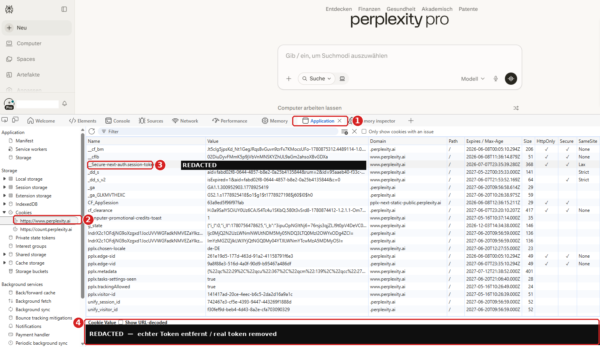

# pplx-tools — Perplexity Pro im headless Codespace / Perplexity Pro in a headless Codespace

Authentifiziert den Perplexity-MCP-Daemon in einem Codespace als **Pro**, ohne
Browser-Login (der an Cloudflare auf der Datacenter-IP scheitert). Stattdessen wird
ein lokal exportierter Session-Cookie (`__Secure-next-auth.session-token`) in den
verschlüsselten Vault injiziert.

> Authenticates the Perplexity MCP daemon in a Codespace as **Pro** without a browser
> login (which fails at Cloudflare on the datacenter IP). Instead, a locally exported
> session cookie is injected into the encrypted vault.

> **Bewiesen / Proven:** Cloudflare blockt nur *unauthentifizierte* Calls von der
> Codespace-IP. Mit gültiger Session laufen `perplexity_search` & Co. über impit (HTTP)
> durch. — *Cloudflare only blocks unauthenticated calls from the Codespace IP; with a
> valid session, `perplexity_search` & co. run over impit (HTTP).*

## Dateien / Files
| Datei / File | Zweck / Purpose |
|---|---|
| `pplx-refresh.sh` | **Hauptbefehl / main command** — injiziert Cookie, triggert Reinit, verifiziert |
| `pplx-inject.mjs` | schreibt den Cookie in den Vault (von refresh aufgerufen) / writes the cookie into the vault |
| `pplx-setup.sh` | installiert die zur Extension passende Chromium-Revision (idempotent) |
| `pplx-status.sh` | zeigt den aktuellen Auth-Status / shows current auth status |

---

## 🇩🇪 Session erneuern (wenn der Cookie abläuft, ~monatlich)

1. **Cookie im Browser auslesen** (siehe annotierter Screenshot unten): Lokaler Browser
   auf perplexity.ai eingeloggt → **F12** → Reiter **Application** ① → links unter
   **Cookies** die Domain **`https://www.perplexity.ai`** ② → Zeile
   **`__Secure-next-auth.session-token`** ③ anklicken → unten im **Cookie Value**-Panel ④
   (Häkchen *Show URL-decoded* **AUS**) den Rohwert (`eyJ…`) kopieren.
2. **Wert in `~/pplx-cookies.txt`** einfügen (nur den Wert), speichern:
   ```bash
   printf '%s' 'DEIN_TOKEN_HIER' > ~/pplx-cookies.txt && chmod 600 ~/pplx-cookies.txt
   ```
3. **Refresh ausführen** im Codespace:
   ```bash
   ~/pplx-tools/pplx-refresh.sh
   ```
   Erwartet: `✅ authenticated — tier: Pro`.
   > Läuft im Codespace ein **benanntes Profil** (nicht das Default `codespace`), voranstellen:
   > `PERPLEXITY_PROFILE=<profil> ~/pplx-tools/pplx-refresh.sh`
4. **Klartext-Token löschen** (er liegt jetzt verschlüsselt im Vault):
   ```bash
   shred -u ~/pplx-cookies.txt 2>/dev/null || rm -f ~/pplx-cookies.txt
   ```

### Status prüfen
```bash
~/pplx-tools/pplx-status.sh
```

---

## 🇬🇧 Renew the session (when the cookie expires, ~monthly)

1. **Read the cookie in the browser** (see annotated screenshot below): in a local browser
   logged in to perplexity.ai → **F12** → **Application** tab ① → on the left under
   **Cookies** select domain **`https://www.perplexity.ai`** ② → click the row
   **`__Secure-next-auth.session-token`** ③ → in the **Cookie Value** panel ④ at the bottom
   (uncheck *Show URL-decoded*) copy the raw value (`eyJ…`).
2. **Put the value into `~/pplx-cookies.txt`** (value only), save:
   ```bash
   printf '%s' 'YOUR_TOKEN_HERE' > ~/pplx-cookies.txt && chmod 600 ~/pplx-cookies.txt
   ```
3. **Run the refresh** in the Codespace:
   ```bash
   ~/pplx-tools/pplx-refresh.sh
   ```
   Expected: `✅ authenticated — tier: Pro`.
   > If the Codespace uses a **named profile** (not the default `codespace`), prepend:
   > `PERPLEXITY_PROFILE=<profile> ~/pplx-tools/pplx-refresh.sh`
4. **Delete the plaintext token** (it now lives encrypted in the vault):
   ```bash
   shred -u ~/pplx-cookies.txt 2>/dev/null || rm -f ~/pplx-cookies.txt
   ```

### Check status
```bash
~/pplx-tools/pplx-status.sh
```

---

## Screenshot

Annotierter Screenshot (echter Token geschwärzt) / Annotated screenshot (real token redacted):



| # | Element | DE | EN |
|---|---|---|---|
| ① | **Application** | DevTools-Speicherpanel | DevTools storage panel |
| ② | `https://www.perplexity.ai` | richtige Cookie-Domain | the right cookie domain |
| ③ | `__Secure-next-auth.session-token` | der benötigte Cookie | the required cookie |
| ④ | **Cookie Value** | hier den Wert kopieren | copy the value here |

> ⚠️ Der Session-Token ist ein vollwertiges Login-Geheimnis — niemals committen, teilen
> oder in Screenshots/Logs sichtbar lassen. *The session token is a full login secret —
> never commit, share, or leave it visible in screenshots/logs.*

---

## Hinweise / Notes
- **„Sync All IDEs" nicht nötig / not needed** — der Codespace-Daemon wird direkt
  authentifiziert. / the Codespace daemon is authenticated directly.
- Die Panel-Warnung *„Models refresh failed: Cloudflare challenge"* ist kosmetisch:
  Der periodische Models-Refresh nutzt den Browser-/Turnstile-Pfad (scheitert auf der
  Datacenter-IP). Suche & Auth funktionieren trotzdem. / The *"Models refresh failed:
  Cloudflare challenge"* warning is cosmetic; search & auth still work.
- Passphrase wird nie geraten — sie wird zur Laufzeit aus der Umgebung des laufenden
  Daemons gelesen (`/proc/<pid>/environ`). / The passphrase is never guessed; it is read
  at runtime from the running daemon's environment (`/proc/<pid>/environ`).
- Doctor `browser: FAIL` (kein Chrome auf PATH) ist **erwartet** — mit gültiger Session
  irrelevant. / `browser: FAIL` is **expected** and irrelevant with a valid session.
